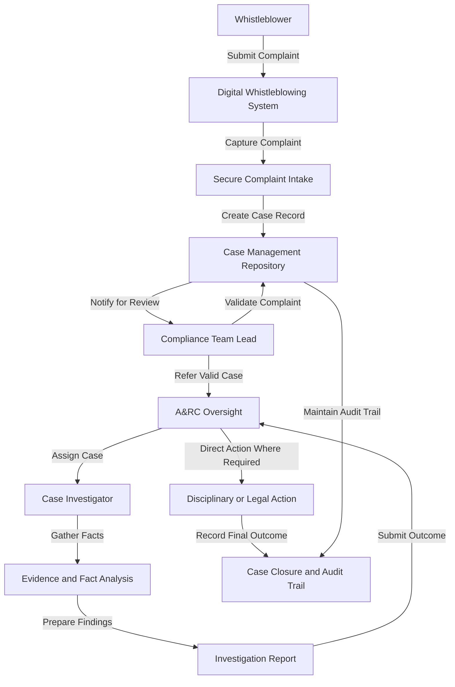
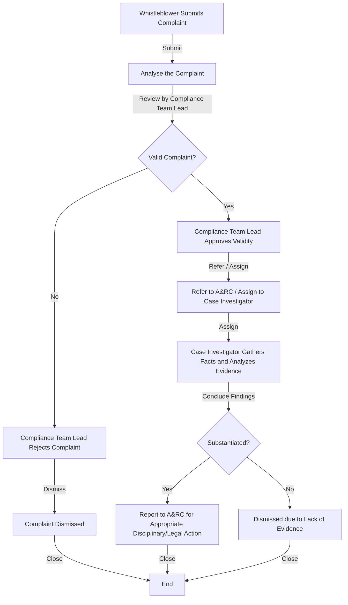

# DWBS System Architecture

```mermaid
graph TD
    WB[Whistleblower]
    DWBS[Digital Whistleblowing System]
    INTAKE[Secure Complaint Intake]
    CASE[Case Management Repository]
    CTL[Compliance Team Lead]
    ARC[A&RC Oversight]
    INV[Case Investigator]
    EVID[Evidence and Fact Analysis]
    REPORT[Investigation Report]
    ACTION[Disciplinary or Legal Action]
    CLOSE[Case Closure and Audit Trail]

    WB -->|Submit Complaint| DWBS
    DWBS -->|Capture Complaint| INTAKE
    INTAKE -->|Create Case Record| CASE
    CASE -->|Notify for Review| CTL
    CTL -->|Validate Complaint| CASE
    CTL -->|Refer Valid Case| ARC
    ARC -->|Assign Case| INV
    INV -->|Gather Facts| EVID
    EVID -->|Prepare Findings| REPORT
    REPORT -->|Submit Outcome| ARC
    ARC -->|Direct Action Where Required| ACTION
    ACTION -->|Record Final Outcome| CLOSE
    CASE -->|Maintain Audit Trail| CLOSE
```

# Case Management Flow

```mermaid
graph TD
    START[Whistleblower Submits Complaint]
    ANALYSE[Analyse the Complaint]
    VALID{Valid Complaint?}
    REJECT[Compliance Team Lead Rejects Complaint]
    DISMISSED[Complaint Dismissed]
    APPROVE[Compliance Team Lead Approves Validity]
    REFER[Refer to A&RC / Assign to Case Investigator]
    INVESTIGATE[Case Investigator Gathers Facts and Analyzes Evidence]
    SUBSTANTIATED{Substantiated?}
    REPORT[Report to A&RC for Appropriate Disciplinary/Legal Action]
    NOEVIDENCE[Dismissed due to Lack of Evidence]
    END[End]

    START -->|Submit| ANALYSE
    ANALYSE -->|Review by Compliance Team Lead| VALID
    VALID -->|No| REJECT
    REJECT -->|Dismiss| DISMISSED
    DISMISSED -->|Close| END
    VALID -->|Yes| APPROVE
    APPROVE -->|Refer / Assign| REFER
    REFER -->|Assign| INVESTIGATE
    INVESTIGATE -->|Conclude Findings| SUBSTANTIATED
    SUBSTANTIATED -->|Yes| REPORT
    REPORT -->|Close| END
    SUBSTANTIATED -->|No| NOEVIDENCE
    NOEVIDENCE -->|Close| END
```
